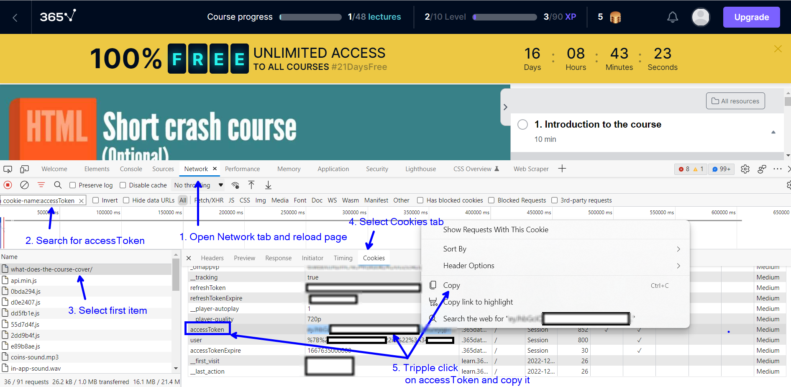
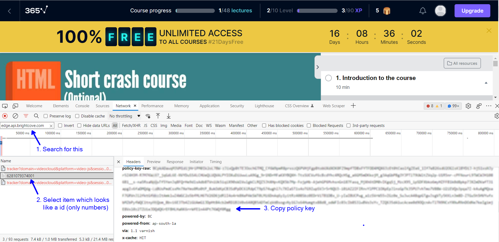

# 365datascience_downloader
Simple course downloader for 365datascience.com

## Pre-Requisite

1. Install [ffmpeg](https://www.videoproc.com/resource/how-to-install-ffmpeg.htm)
2. Install [Python 3.8+](https://www.xda-developers.com/how-to-install-python/)

## Usage

### Get authorization token and policy key to access API.

1. Open any [course video](https://learn.365datascience.com/courses/web-scraping-and-api-fundamentals-in-python/what-does-the-course-cover/). If it's prompt you to sign-in, then do so.
2. Open [developer tool in browser](https://www.computerhope.com/issues/ch002153.htm) and go to the **Network** tab.
3. Reload the page (CTRL + R).
4. Search for `cookie-domain:.365datascience.com cookie-name:accessToken` or `cookie-domain:.365datascience.com cookie-name:refreshToken` -> Go to Cookies tab -> Copy the accessToken or refreshToken (I would suggest copy the refreshToken) -> Paste in [input.json](src\365datascience_course_downloader\input.json) in `authorization_token`.



5. Search for `edge.api.brightcove.com` -> Go to Headers -> Copy policy-key-raw -> Paste in [input.json](src\365datascience_course_downloader\input.json) in `policy_key`.



### Downloading a course

Once you have pasted `authorization_token` and `policy_key`, you can update the course url in [input.json](src\365datascience_course_downloader\input.json) in `course_url`. The final input.json may look something like this:

```json
{
    "course_url": "https://learn.365datascience.com/courses/preview/intro-to-data-and-data-science/",
    "authorization_token": "<some authentication token>",
    "policy_key": "<some policy key>",
    "quality": "1080p"
}
```

#### Download single course

1. Create Python virtual environment and activate it.

```console
python -m venv .env
.env/Script/activate
```

NOTE: How to activate virtual environment might vary based on OS. Check [official documentation](https://docs.python.org/3/library/venv.html).

2. Install dependencies: `pip install -r requirements.txt`
3. Run the course download script: `python src/download_single_course.py`
4. Once over you will find the course in your downlods folder.

<details>
<summary>Download folder for "Introduction to Data and Data Science" course:</summary>

```
📦365DataScience
 ┗ 📂Introduction to Data and Data Science
 ┃ ┣ 📂1 - The Different Data Science Fields
 ┃ ┃ ┣ 📜1 - Course Introduction.mp4
 ┃ ┃ ┣ 📜10 - An Overview of our Data Science Infographic.mp4
 ┃ ┃ ┣ 📜2 - Why are there so many business and data science buzzwords.mp4
 ┃ ┃ ┣ 📜4 - Analysis vs Analytics.mp4
 ┃ ┃ ┣ 📜6 - Intro to Business Analytics Data Analytics and Data Science.mp4
 ┃ ┃ ┗ 📜8 - Adding Business Intelligence BI Machine Learning ML and Artificial Intelligence AI to the picture.mp4
 ┃ ┣ 📂2 - The Relationship between Different Data Science Fields
 ┃ ┃ ┗ 📜1 - When are Traditional data Big Data BI Traditional Data Science and ML applied.mp4
 ┃ ┣ 📂3 - What is the Purpose of each Data Science field
 ┃ ┃ ┗ 📜1 - Why do we Need each of these Disciplines.mp4
 ┃ ┣ 📂4 - Common Data Science Techniques
 ┃ ┃ ┣ 📜1 - Traditional Data Techniques.mp4
 ┃ ┃ ┣ 📜10 - Traditional Methods Reallife Examples.mp4
 ┃ ┃ ┣ 📜11 - Machine Learning ML Techniques.mp4
 ┃ ┃ ┣ 📜12 - Machine Learning ML Types of Machine Learning.mp4
 ┃ ┃ ┣ 📜14 - Machine Learning ML Reallife Examples.mp4
 ┃ ┃ ┣ 📜3 - Traditional Data Reallife Examples.mp4
 ┃ ┃ ┣ 📜4 - Big Data Techniques.mp4
 ┃ ┃ ┣ 📜5 - Big Data Reallife Examples.mp4
 ┃ ┃ ┣ 📜6 - Business Intelligence BI Techniques.mp4
 ┃ ┃ ┣ 📜8 - Business Intelligence BI Reallife Examples.mp4
 ┃ ┃ ┗ 📜9 - Traditional Methods Techniques.mp4
 ┃ ┣ 📂5 - Common Data Science Tools
 ┃ ┃ ┗ 📜1 - Programming Languages  Software Employed in Data Science  All the Tools You Need.mp4
 ┃ ┣ 📂6 - Data Science Job Positions What do they Involve and What to Look out for
 ┃ ┃ ┗ 📜1 - Data Science Job Positions What do they Involve and What to Look out for.mp4
 ┃ ┗ 📂7 - Dispelling common Misconceptions
 ┃ ┃ ┗ 📜1 - Dispelling Common Misconceptions.mp4
```

</details>

#### Download all course

1. Create virtual environment, activate it and install all dependency. Follow previous section for detailed step.
2. Run the course download script: `python src/download_all_course.py`

## TODO

- [x] Download subtitles
- [x] Download all course resource
- [x] Download all course
- [ ] Add Google colab notebook
